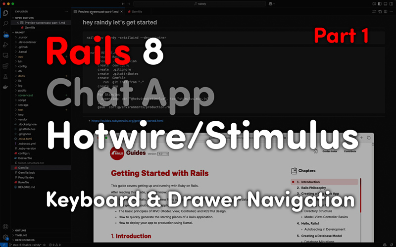
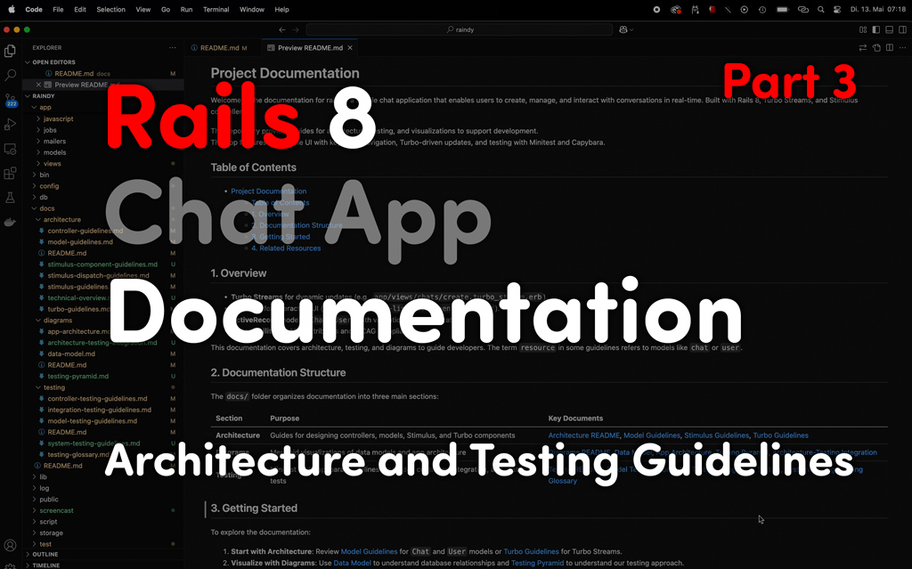

# Raindy: A Minimalist Rails 8 Chat App

Let's Chat Beautifully! 🩵🧡❤️

Welcome to **Raindy** (Rails + Aindy), a simple yet powerful chat application built with Rails 8, Tailwind, SQLite, Hotwire (Turbo Streams, Stimulus), and Propshaft. Designed for real-time conversation management, the app emphasizes accessibility (WCAG compliance, keyboard navigation), progressive web app (PWA) support, and a robust testing suite using Minitest and Capybara. Inspired by the Rails Foundation's best practices, Raindy is both an educational project and a fun exploration of modern Rails development.

## Table of Contents
- [Raindy: A Minimalist Rails 8 Chat App](#raindy-a-minimalist-rails-8-chat-app)
  - [Table of Contents](#table-of-contents)
  - [1. Introduction](#1-introduction)
  - [2. Screencast Series](#2-screencast-series)
  - [3. Getting Started](#3-getting-started)
    - [Prerequisites](#prerequisites)
    - [Setup Steps](#setup-steps)
  - [4. Running Tests](#4-running-tests)
  - [5. Documentation](#5-documentation)
  - [6. Contributing](#6-contributing)
  - [7. Related Resources](#7-related-resources)

## 1. Introduction

Raindy lets users sign in, create and manage chats, and navigate a dashboard with a drawer (`<dialog>` element) and dropdown menu, all powered by Turbo Streams for dynamic updates and Stimulus for interactive UI. Key features include:
- **Authentication**: Secure user sign-in/out with `has_secure_password` and session management.
- **Chat Management**: CRUD actions for chats, with inline editing via Turbo Frames and server-side validations.
- **Accessibility**: ARIA attributes, keyboard navigation (Tab, Enter, Escape, arrow keys), and focus restoration.
- **PWA Support**: Standalone mode detection via `pwa_controller` for mobile-friendly layouts.
- **Testing**: Comprehensive Minitest suite (model, controller, integration, system) with Capybara for UI interactions.

Built with Rails 8's modern stack (Hotwire, Propshaft, Tailwind), using concerns (`UuidConcern`, `SanitizationConcern`) and database-driven UUIDs. 

Whether you're a Rails enthusiast or an AI teammate (like in my `Caindy` project), Raindy is a playground for learning and collaboration.

## 2. Screencast Series

Explore Raindy's development through my screencast series, where I share the journey of building, testing, and documenting the app. Watch them for insights, discoveries, and a bit of fun from Hamburg!

| Part 1: Project Overview          | Part 2: Testing             | Part 3: Documentation          |
| :-------------------------------- | :------------------------  | :----------------------------- |
| [](https://youtu.be/PBKgxrDKwLc)  <br><br> Covers setup (`rails new Raindy -c tailwind`), authentication, dashboard, drawer, main navigation, and the `Chat` model. Highlights accessibility (keyboard navigation) and Turbo-driven CRUD actions. <br><br>*"Hui — pretty fast… Simple — but I like it."*   | [](https://youtu.be/Itw5lUlpcJI)  <br><br> Dives into Minitest and Capybara tests for controllers (`ChatsController`), models (`User`, `Chat`), integration flows, and system UI interactions. Explains naming conventions and `<dialog>` test tweaks. <br><br>*"415 + 175 assertions — awesome. Check. And done."* | [](https://youtu.be/8o3wrLxDPww)  <br><br> Walks through the `docs/` folder, covering architecture, testing, and Mermaid diagrams. Discusses AI collaboration (from `Candy`) and documentation's role.  <br><br>*"I've got the same love–hate (or is it hate–love? grin) relationship as many of you."* |

## 3. Getting Started

### Prerequisites
- Ruby 3.4.1 (use [`mise`](https://mise.jdx.dev/) or your preferred version manager)

### Setup Steps
1. **Clone the repository**:
   ```bash
   git clone https://github.com/aindy-eu/raindy.git
   cd raindy
   ```
2. **Install Tools and Dependencies**:
   ```bash
   mise install        # Installs Ruby 3.4.1
   bin/setup           # Installs gems, sets up SQLite DB, runs migrations
   ```
3. **Seed the Database**:
   Change my 'foo@bar.de' to your email address and seed the database:
   ```bash
   bin/rails db:seed
   ```
4. **Start Development Server**:
   ```bash
   bin/dev             # Runs Rails and TailwindCSS watcher
   ```
   Open [http://localhost:3044](http://localhost:3044).

For more detailed technical information, see the [Technical Overview](/docs/architecture/technical-overview.md).


## 4. Running Tests

Raindy's test suite uses Minitest and Capybara, with FactoryBot for data setup. Due to `<dialog>` element issues in headless Chrome, system tests must run individually in CI.

```bash
# Run all tests (except system tests ;)
bin/rails test

# Run system tests (required for CI/headless)
find test/system/ -name '*_test.rb' | xargs -n 1 bin/rails test

# Run a single file
bin/rails test test/system/chats/create_test.rb
```

See [Testing Overview](/docs/testing/README.md) for details and the [Testing Pyramid](/docs/diagrams/testing-pyramid.md) for strategy.

**Debugging Tip**: Use `binding.irb` in model tests or `slow_down(duration = 1)` in system tests for animations.

## 5. Documentation

The `docs/` folder is your guide to Raindy's architecture, testing, and visualizations:
- **Architecture**: Learn about models (`Chat`, `User`), controllers, and Turbo/Stimulus patterns in [Architecture Overview](/docs/architecture/README.md) and [Model Guidelines](/docs/architecture/model-guidelines.md).
- **Diagrams**: Visualize the database and app structure with Mermaid diagrams in [Diagrams README](/docs/diagrams/README.md) and [Data Model](/docs/diagrams/data-model.md).
- **Testing**: Follow testing conventions in [Testing Overview](/docs/testing/README.md) and specific guidelines (e.g., [Model Testing](/docs/testing/model-testing-guidelines.md)).

Start with [Project Documentation](/docs/README.md) for a high-level guide.

## 6. Contributing

Raindy is an educational project created for fun and learning purposes. It's not actively accepting contributions at this time.

Feel free to fork the repository and experiment with it for your own learning.  


## 7. Related Resources

- **Code**:
  - [Chats Controller](/app/controllers/chats_controller.rb)
  - [Chat Model](/app/models/chat.rb)
  - [User Model](/app/models/user.rb)
  - [Drawer Controller](/app/javascript/controllers/components/drawer_controller.js)
  - [Turbo Stream View](/app/views/chats/create.turbo_stream.erb)
- **Documentation**:
  - [Project Documentation](/docs/README.md)
  - [Architecture Overview](/docs/architecture/README.md)
  - [Model Testing Guidelines](/docs/testing/model-testing-guidelines.md)
  - [Testing Overview](/docs/testing/README.md)
  - [Data Model Diagram](/docs/diagrams/data-model.md)
- **External**:
  - [Rails Guides](https://guides.rubyonrails.org)
  - [Hotwire Docs](https://hotwired.dev/)
  - [TailwindCSS Docs](https://tailwindcss.com/docs)
  - [Stimulus Reference](https://stimulus.hotwired.dev/reference)
  - [Mermaid Documentation](https://mermaid-js.github.io/mermaid/)

---

Let's Chat Beautifully! 🩵🧡❤️