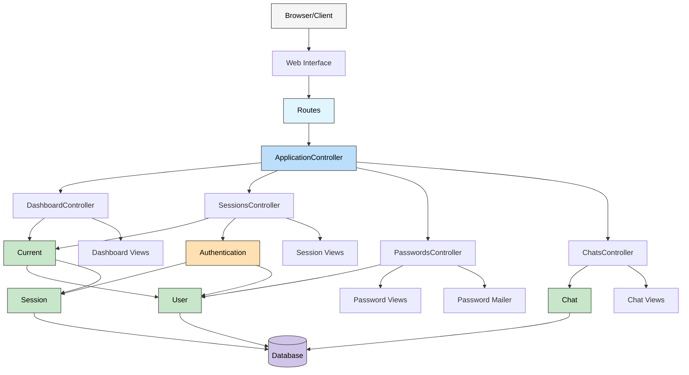

<!--
---
title: "Rails Application Architecture"
description: "Mermaid diagram illustrating the Rails application architecture and component relationships"
updated: "2025-05-15 10:24:00"
status: "Done 🤎"
contributors:
  - username: aindy
    ai: false
  - username: cursor-anthropic-claude-3-7-sonnet
    ai: true
pillar: "Architecture"
tags: ["diagram", "architecture", "rails", "controllers", "models"]
related_docs:
  - path: "/docs/testing/README.md"
  - path: "/docs/diagrams/data-model.md"
  - path: "/docs/architecture/README.md"
---
-->

# Rails Application Architecture

## Related Resources

- **Code**:
  - [ApplicationController](/app/controllers/application_controller.rb)
  - [DashboardController](/app/controllers/dashboard_controller.rb)
  - [SessionsController](/app/controllers/sessions_controller.rb)
  - [PasswordsController](/app/controllers/passwords_controller.rb)
  - [ChatsController](/app/controllers/chats_controller.rb)
- **Guidelines**:
  - [Diagrams README](/docs/diagrams/README.md)
  - [Architecture README](/docs/architecture/README.md)
- **External**:
  - [Mermaid Documentation](https://mermaid-js.github.io/mermaid/)
  
---

Let's **Visualize** Beautifully! 🧡