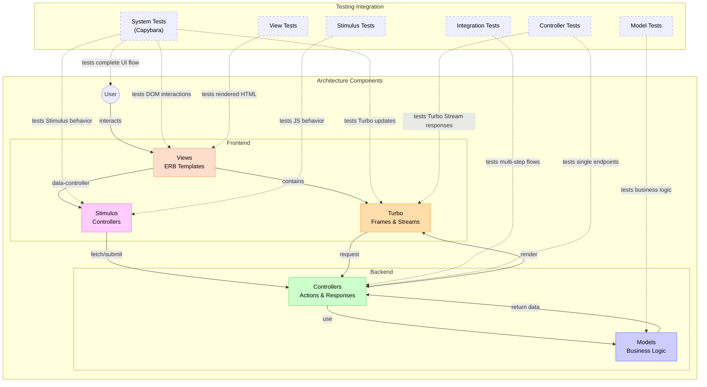

# Architecture-Testing Integration

This diagram illustrates how our architectural components integrate with our testing strategy:

1. **Architecture Components**:
   - **Models**: Core business logic, validations, and data relationships
   - **Controllers**: Handle HTTP requests, process params, and render responses
   - **Views**: ERB templates that define UI structure
   - **Turbo**: Frames and Streams for partial page updates
   - **Stimulus**: JavaScript controllers for interactive behavior

2. **Testing Integration**:
   - **Model Tests**: Directly test business logic in isolation
   - **Controller Tests**: Verify HTTP endpoints and Turbo Stream responses
   - **Integration Tests**: Test multi-step flows across controllers
   - **System Tests**: End-to-end tests of complete user workflows
   - **Stimulus Tests**: Verify JavaScript component behavior
   - **View Tests**: Check correct HTML rendering

Each component is designed with testability in mind:
- **Controllers** use RESTful patterns that map cleanly to controller tests
- **Stimulus controllers** follow consistent patterns that can be tested in isolation
- **Turbo Streams** use predictable DOM IDs that system tests can reliably target
- **Models** separate concerns (validations, associations) for focused testing

This architecture enables our [Testing Pyramid](/docs/diagrams/testing-pyramid.md) approach, with more tests at lower levels (models, controllers) and fewer, more comprehensive tests at higher levels (system). 

## Related Resources

- **Code**:
  - [ApplicationController](/app/controllers/application_controller.rb)
  - [ChatsController](/app/controllers/chats_controller.rb)
  - [Chat Model](/app/models/chat.rb)
  - [User Model](/app/models/user.rb)
- **Guidelines**:
  - [Diagrams README](/docs/diagrams/README.md)
  - [Testing README](/docs/testing/README.md)
- **External**:
  - [Mermaid Documentation](https://mermaid-js.github.io/mermaid/)

---

Let's **Visualize** Beautifully! 🧡