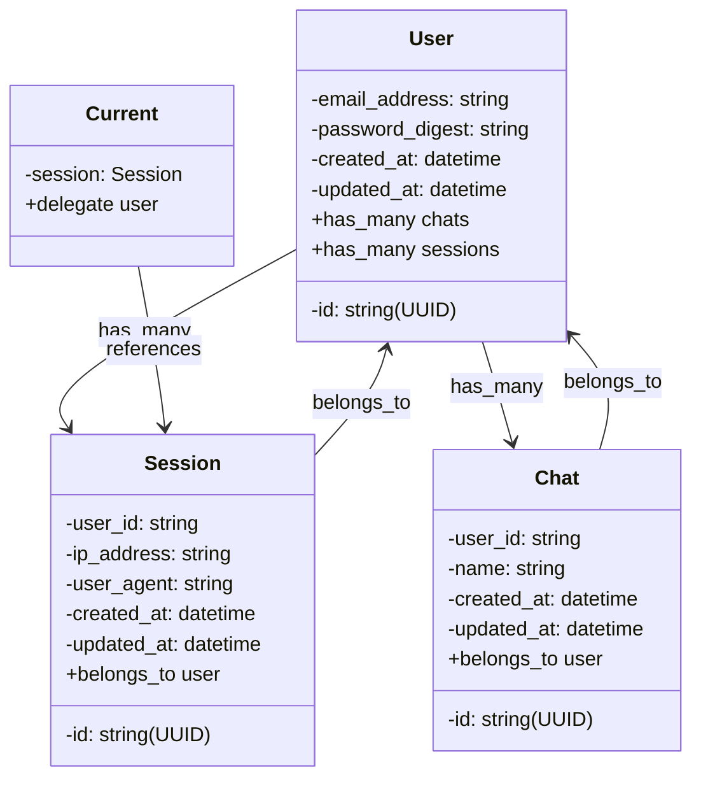

# Data Model

## Related Resources

- **Code**:
  - [Chat Model](/app/models/chat.rb)
  - [Session Model](/app/models/session.rb)
  - [User Model](/app/models/user.rb)
- **Guidelines**:
  - [Diagrams README](/docs/diagrams/README.md)
  - [Architecture README](/docs/architecture/README.md)
- **External**:
  - [Mermaid Documentation](https://mermaid-js.github.io/mermaid/)

---

Let's **Visualize** Beautifully! 🧡
