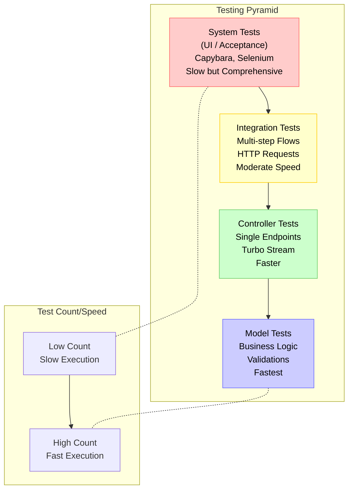

# Testing Pyramid

The testing pyramid visualizes the different types of tests in our application and their relationships:

1. **Model Tests** (Bottom Layer):
   - Fastest execution, highest quantity
   - Test business logic, validations, associations
   - Example: Verify a chat requires a name

2. **Controller Tests**:
   - Test single HTTP endpoints and Turbo Stream responses
   - Example: Verify chat creation returns correct turbo_stream

3. **Integration Tests**:
   - Test multi-step flows across controllers
   - Example: Sign in and create a chat

4. **System Tests** (Top Layer):
   - Slowest execution, lowest quantity
   - Test end-to-end workflows with browser simulation
   - Example: User signs in, opens drawer, creates chat with keyboard

This pyramid follows the testing philosophy described in the [Testing Overview](/docs/testing/README.md), with more tests at lower levels (model, controller) and fewer, more comprehensive tests at higher levels (integration, system). 

## Related Resources

- **Code**:
  - [ApplicationController](/app/controllers/application_controller.rb)
  - [ChatsController](/app/controllers/chats_controller.rb)
  - [Chat Model](/app/models/chat.rb)
  - [User Model](/app/models/user.rb)
- **Guidelines**:
  - [Diagrams README](/docs/diagrams/README.md)
  - [Testing README](/docs/testing/README.md)
- **External**:
  - [Mermaid Documentation](https://mermaid-js.github.io/mermaid/)

---

Let's **Visualize** Beautifully! 🧡